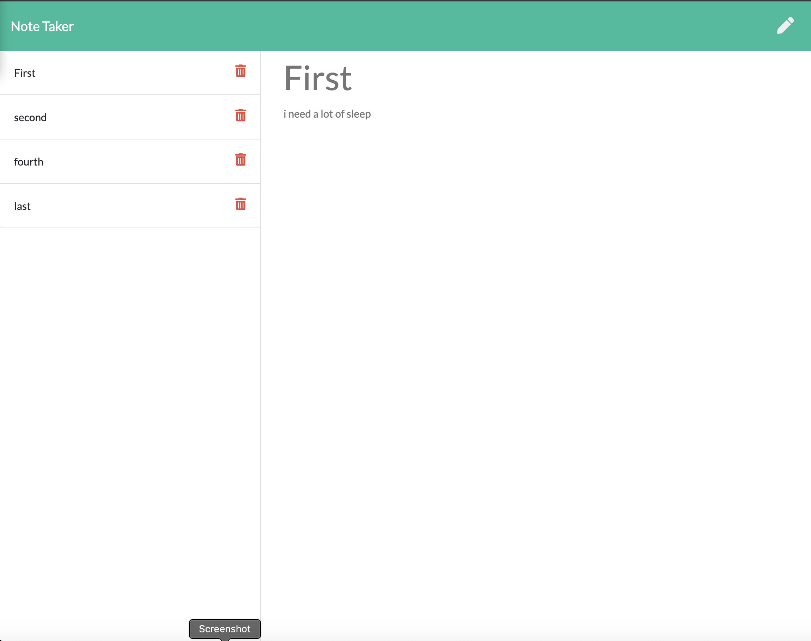

# Note-Taker

[](http://unlicense.org/)

## Description
This project allows users to post and delete notes to organize tasks and to dos.




## Table of Contents
* [Installation](#installation)
* [Usage](#usage)
* [Contribute](#contribute)
* [Tests](#tests)
* [Questions](#questions)
## Installion
For this project be sure to run the following command in your terminal to install the necessary dependencies.
```
npm i
```

## Usage
user opens up the terminal and installs dependencies and then runs the application using express in heroku.
## License
Unlicense## Contribute
email bfitzpatrick28@gmail.com
## Tests
```
npm test
```

## Questions
If you have any questions at all please reach out to [fitzpatb](https://github.com/fitzpatb/Note-Taker) or email directly at bfitzpatrick28@gmail.com